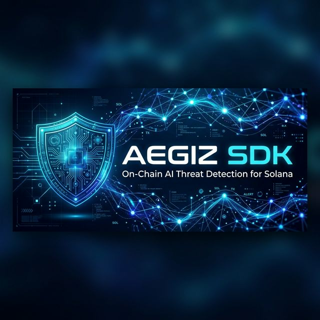
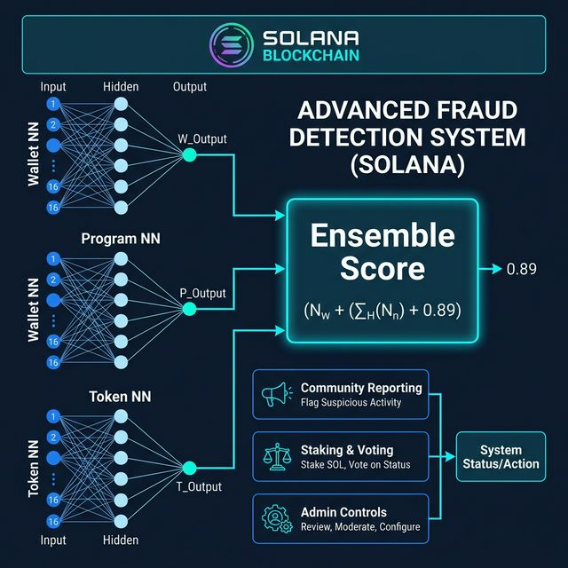

<p align="center">
  
</p>

<h1 align="center">@aegiz/sdk</h1>

<p align="center">
  <strong>On-Chain AI Threat Detection for Solana</strong>
</p>

<p align="center">
  <a href="https://www.npmjs.com/package/@aegiz/sdk"></a>
  <a href="https://github.com/Bytez3/aegiz-sdk/blob/main/LICENSE"></a>
  <a href="https://solana.com"></a>
  <a href="https://aegiz.dev"></a>
</p>

<p align="center">
  <a href="#installation">Installation</a> •
  <a href="#quick-start">Quick Start</a> •
  <a href="#architecture">Architecture</a> •
  <a href="#api-reference">API Reference</a> •
  <a href="#links">Links</a>
</p>

---

Aegiz is a neural network that runs **entirely on-chain** — it trains, learns, and predicts inside a Solana smart contract. No servers. No APIs. No trust required.

This SDK lets you integrate Aegiz threat detection into your dApp, wallet, or service.

## Architecture

<p align="center">
  
</p>

Three independent neural networks run **on-chain** and combine into an ensemble risk score:

| Neural Network | Features | Purpose |
|---|---|---|
| **Wallet NN** | 16 → 8 → 1 (145 params) | Balance analysis, drain detection, risk streaks |
| **Program NN** | 16 → 8 → 1 (145 params) | Upgrade authority, binary size, deployer reputation |
| **Token NN** | 16 → 8 → 1 (145 params) | Mint/freeze authority, supply analysis, rugpull signals |

> **435 active parameters** across 3 sub-networks, with 1500 total reserved slots for future expansion.

## Installation

```bash
npm install @aegiz/sdk
```

Peer dependencies:
```bash
npm install @solana/web3.js @coral-xyz/anchor
```

## Quick Start

### Read-Only (No Wallet Required)

```typescript
import { AegizClient } from "@aegiz/sdk";
import { PublicKey } from "@solana/web3.js";

// Connect to mainnet (default) or devnet
const client = new AegizClient("https://api.devnet.solana.com");

// Quick risk check — works for wallets AND programs
const result = await client.quickCheck(new PublicKey("SomeAddress..."));
console.log(result.tier);       // "low" | "moderate" | "high" | "critical"
console.log(result.riskScore);  // 0-100
console.log(result.type);       // "wallet" | "program" | "unknown"

// Get detailed wallet reputation
const rep = await client.getWalletReputation(walletPubkey);

// Get program reputation
const progRep = await client.getProgramReputation(programId);

// Get token mint analysis
const mint = await client.getTokenMintAnalysis(mintPubkey);

// Get model stats (version, accuracy, active params)
const stats = await client.getModelStats();
console.log(stats.walletActiveParams);  // 145/145
console.log(stats.programActiveParams); // 145/145
console.log(stats.tokenActiveParams);   // 145/145
```

### With Wallet (Transactions)

```typescript
import { AegizTransactionClient } from "@aegiz/sdk";
import { AnchorProvider } from "@coral-xyz/anchor";

const provider = AnchorProvider.env();
const client = new AegizTransactionClient(provider);

// Predict risk for a wallet
const prediction = await client.predict(targetWallet);
console.log(prediction.riskScore);     // 0-100
console.log(prediction.drainDetected); // boolean

// Scan a program for threats
await client.scanProgram(programId, programDataPda);

// Scan a token mint for rugpull signals
await client.scanTokenMint(mintPubkey);

// Ensemble score (combines all three NNs)
await client.ensembleScore(walletRepPda, programRepPda, mintAnalysisPda);

// Community reporting
await client.reportScam(scamWallet, "Drainer — stole 50 SOL", 10_000_000);
await client.reportScamProgram(scamProgram, "Fake DEX", 10_000_000);

// Vote on reports
await client.voteOnReport(blacklistEntry, true);   // confirm
await client.voteOnProgramReport(blacklistEntry, false); // dispute
```

## API Reference

### `AegizClient` — Read-Only

| Method | Description |
|---|---|
| `quickCheck(address)` | Quick risk lookup for any address |
| `getWalletReputation(wallet)` | Full wallet reputation data |
| `getProgramReputation(program)` | Full program reputation data |
| `getTokenMintAnalysis(mint)` | Token mint analysis (rugpull signals) |
| `getReporterProfile(reporter)` | Reporter profile and stats |
| `getModelStats()` | Model version, accuracy, active params |
| `getBlacklistEntry(wallet)` | Wallet blacklist report details |
| `getProgramBlacklistEntry(program)` | Program blacklist report details |
| `classifyRisk(score)` | Score → tier classification |

### `AegizTransactionClient` — Wallet Required

| Method | Description |
|---|---|
| `predict(wallet, txCount?)` | Run AI prediction on a wallet |
| `scanProgram(program, data, auth?)` | Scan a program for threats |
| `scanTokenMint(mint)` | Scan a token mint for rugpull signals |
| `scanTokens(wallet, accounts?)` | Scan token accounts for drainers |
| `ensembleScore(walletRep, progRep?, mint?)` | Combined ensemble risk score |
| `reportScam(wallet, proof, stake?)` | Report a wallet as scam |
| `reportScamProgram(program, proof, stake?)` | Report a program as scam |
| `voteOnReport(entry, confirm, stake?)` | Vote on a wallet report |
| `voteOnProgramReport(entry, confirm, stake?)` | Vote on a program report |

### Admin Methods

| Method | Description |
|---|---|
| `confirmScam(entry, wallet)` | Confirm a wallet scam report |
| `confirmScamProgram(program, data, auth?)` | Confirm a program scam report |
| `resolveReport(entry, wallet)` | Resolve a wallet report |
| `resolveProgramReport(entry, program)` | Resolve a program report |
| `rewardReporter(reporter, entry)` | Reward reporter for correct report |
| `rewardProgramReporter(reporter, entry)` | Reward program reporter |
| `setFees(prediction, scanProg, ensemble, scanToken)` | Set system fees |
| `resetAccuracy()` | Reset accuracy counters |
| `withdrawTreasury()` | Withdraw treasury funds |
| `snapshotWeights()` | Snapshot NN weights for rollback |
| `rollbackWeights()` | Rollback to last weight snapshot |
| `removeBlacklistEntry(wallet)` | Remove a blacklist entry |
| `emergencyPause(pause)` | Pause/unpause the system |
| `uploadWeights(weights, chunkSize?)` | Upload NN weights in chunks |

### PDA Helpers

```typescript
import {
  getModelPda,
  getReputationPda,
  getProgramReputationPda,
  getBlacklistPda,
  getProgramBlacklistPda,
  getTreasuryPda,
  getVotePda,
  getMintAnalysisPda,
  getReporterProfilePda,
} from "@aegiz/sdk";
```

## Network

| | Value |
|---|---|
| **Program ID** | `5QA63aoUXwHB6aUSvbzpHejKaqFCf8RafAFjhfjjRVnT` |
| **Architecture** | 3× (16→8→1) Ensemble |
| **Total Parameters** | 435 active / 1500 reserved |
| **SDK Version** | 1.0.0 |

## Features

- 🧠 **On-Chain Neural Network** — Three 16→8→1 NNs running entirely on Solana
- 🛡️ **Ensemble Scoring** — Combined risk assessment from wallet, program, and token analysis
- 👥 **Community Reporting** — Stake-backed scam reporting with voting
- 🔍 **Token Scanning** — Detect honeypots, rugpulls, and drainer patterns
- 📊 **Reputation Tracking** — Persistent wallet and program reputation PDAs
- ⚡ **Zero Trust** — No servers, no APIs, everything verifiable on-chain
- 🏦 **Fee Governance** — Configurable prediction and scan fees
- 🔄 **Weight Snapshots** — Rollback NN weights if needed

## Links

- 🌐 Website: [aegiz.dev](https://aegiz.dev)
- 🐦 Twitter: [@aegizsol](https://x.com/aegizsol)
- 💻 GitHub: [Bytez3/aegiz-sdk](https://github.com/Bytez3/aegiz-sdk)
- 🔗 Explorer: [View on Solana](https://explorer.solana.com/address/5QA63aoUXwHB6aUSvbzpHejKaqFCf8RafAFjhfjjRVnT)

## License

MIT — see [LICENSE](LICENSE) for details.
